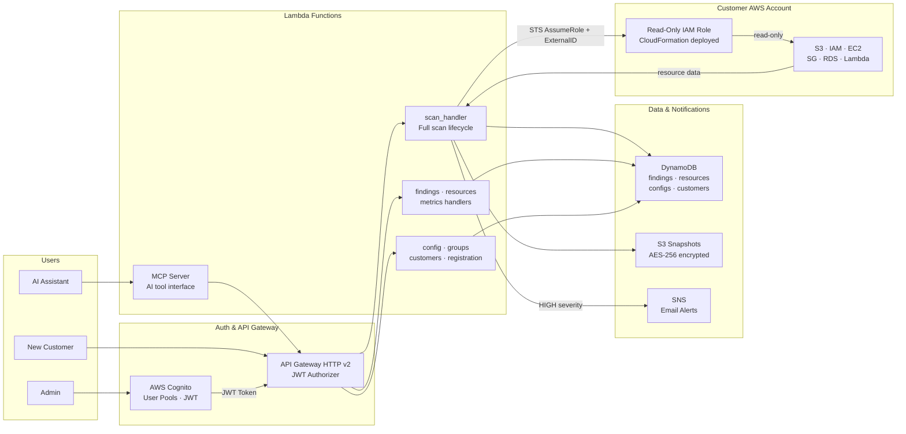

# Thanos — AWS Configuration Drift Detection & Compliance Platform

> *"Perfectly balanced, like all things should be."*

Thanos is a **serverless, multi-tenant AWS compliance platform** that continuously monitors AWS resources for security misconfigurations, quantifies configuration drift, and surfaces actionable findings through a real-time dashboard. It is purpose-built on AWS-native serverless services — Lambda, DynamoDB, API Gateway, Cognito, S3, and SNS — requiring zero servers to manage and scaling automatically from a single account to thousands.

---

## Why It Matters

Configuration drift quietly snowballs into outages and security breaches. A "temporary" firewall rule, a misconfigured S3 bucket, an overly permissive IAM policy — left undetected these become exploitable gaps and compliance violations. Thanos makes drift **visible and quantifiable**: every resource gets a drift score (0.0 = compliant, 1.0 = fully drifted), every deviation is categorized by severity, and hierarchical policies let teams define what "good" looks like at the org, group, and instance level.

**Key differentiators vs. AWS Security Hub / Prisma Cloud:**
- **Per-resource drift scores** rather than binary pass/fail
- **Hierarchical desired-state modeling** — base configs with group-level overrides, not ad-hoc rule exceptions
- **AI-native interface** via Model Context Protocol (MCP) — query your entire infrastructure in natural language
- **Complete resource inventory** — track ALL resources, not only the non-compliant ones
- **Pay-per-use serverless** — starts at ~$1.60/month for light usage

---

## Demo

[](https://youtu.be/rp8iVYyoh4s?si=ABjnC3D90Lea4qsw)

**⏱ Jump to [6:00 – 11:00](https://youtu.be/rp8iVYyoh4s?si=ABjnC3D90Lea4qsw&t=360)** for the live platform walkthrough (dashboard, scan, findings, MCP demo).

---

## Architecture



### How a Scan Works

| Step | What Happens |
|------|-------------|
| **1. Trigger** | Admin selects tenant + regions → `POST /scan` hits API Gateway |
| **2. Auth** | `scan_handler` calls STS `AssumeRole` with ExternalID to get temp credentials |
| **3. Collect** | Parallel API calls across regions collect S3, IAM, EC2, SG, RDS, Lambda configs |
| **4. Snapshot** | Full resource list (2–5 MB JSON) written to S3 for audit history |
| **5. Evaluate** | Each resource is compared against its merged hierarchical desired config |
| **6. Score** | Drift score computed: `min(1.0, differences / 10)`. Compliant = 0.0 |
| **7. Store** | Findings + resources written to DynamoDB; HIGH severity triggers SNS email |
| **8. Display** | Dashboard updates in real-time with compliance %, severity breakdown, findings |

---

## Technology Stack

| Layer | Technology |
|-------|-----------|
| **Frontend** | React 18, TypeScript, Vite, TailwindCSS, shadcn/ui |
| **Backend** | AWS Lambda (Python 3.12), 9 functions |
| **API** | AWS API Gateway HTTP v2, JWT authorization |
| **Auth** | AWS Cognito User Pools |
| **Database** | Amazon DynamoDB (4 tables, on-demand) |
| **Storage** | Amazon S3 (snapshots + static hosting) |
| **Alerts** | Amazon SNS (email notifications) |
| **AI Integration** | Model Context Protocol (MCP) — SSE + stdio |
| **IaC** | Terraform |

---

## Quick Start

### Prerequisites
```bash
terraform --version  # >= 1.0
python3 --version    # >= 3.12
node --version       # >= 18
aws configure        # AWS credentials with admin access
```

### 1. Deploy Infrastructure

```bash
git clone https://github.com/manuvikash/thanos.git
cd thanos
make tf-init     # First time only
make tf-apply    # Deploy all AWS resources (~3 minutes)

# Retrieve admin credentials
cd infra && terraform output -raw admin_temporary_password
```

Default admin login: `admin@example.com`

### 2. Launch Dashboard

```bash
make web-dev
# Dashboard at http://localhost:3001
```

### 3. Onboard an AWS Account

1. Navigate to **Register** (no login required)
2. Enter AWS Account ID + select regions
3. Click **Create Role via CloudFormation** — opens AWS Console to deploy the read-only IAM role
4. Return to the page and click **Verify & Save**
5. From the dashboard, select the tenant and click **Run Scan**

---

## AI Integration (MCP)

Thanos exposes 7 tools via Model Context Protocol, letting AI assistants query your infrastructure in natural language.

### Available Tools

| Tool | Description |
|------|-------------|
| `list_resources` | Query resources with compliance status and drift scores |
| `get_findings` | Retrieve security violations, filtered by severity/type |
| `get_dashboard_metrics` | Compliance trends and scan history |
| `trigger_scan` | Initiate a new scan for any tenant |
| `list_customers` | List all registered tenants |
| `get_rules` | View active compliance rules |
| `search_violations` | Full-text search across all findings |

### Setup

1. Generate an API key from **Dashboard → MCP Settings**
2. Add to `claude_desktop_config.json`:

```json
{
  "mcpServers": {
    "thanos": {
      "url": "https://your-mcp-lambda-url.amazonaws.com",
      "headers": { "x-api-key": "thanos_mcp_your_key_here" }
    }
  }
}
```

**Example queries:**
```
"Show me all HIGH severity findings for customer-prod"
"What's the drift score for S3 buckets in us-east-1?"
"List all security groups allowing SSH from 0.0.0.0/0"
"Trigger a scan for acme-staging in eu-west-1"
```

See [mcp/README.md](mcp/README.md) for full setup including Gemini CLI.

---

## Project Structure

```
thanos/
├── infra/                          # Terraform — all AWS infrastructure
│   ├── main.tf                     # Provider + backend config
│   ├── lambda*.tf                  # Lambda function definitions (9 functions)
│   ├── dynamodb*.tf                # DynamoDB tables (findings, resources, configs, customers)
│   ├── api*.tf                     # API Gateway routes and integrations
│   ├── cognito.tf                  # Cognito User Pool + app client
│   ├── s3.tf                       # Snapshot bucket + web hosting bucket
│   ├── sns.tf                      # Alert topic + email subscription
│   └── customer-onboarding-role.yaml   # CloudFormation template for customer IAM role
│
├── lambdas/                        # Python backend
│   ├── common/                     # Shared libraries used by all handlers
│   │   ├── eval.py                 # Drift scoring + compliance evaluation engine
│   │   ├── config_merger.py        # Hierarchical config deep-merge algorithm
│   │   ├── normalize.py            # AWS resource config normalization
│   │   ├── resource_inventory.py   # Cross-account AWS resource collection
│   │   ├── ddb.py                  # DynamoDB helpers
│   │   └── models.py               # Shared data models
│   ├── scan_handler/               # Core: orchestrates full scan lifecycle
│   ├── findings_handler/           # Query and filter security findings
│   ├── resources_handler/          # Query resource inventory
│   ├── config_handler/             # CRUD for base configurations
│   ├── groups_handler/             # CRUD for resource groups + selectors
│   ├── customers_handler/          # Tenant management
│   ├── metrics_handler/            # Dashboard KPIs and compliance trends
│   ├── registration_handler/       # Customer self-service onboarding
│   ├── alerts_config_handler/      # Alert threshold configuration
│   ├── mcp_server/                 # AI tool server (SSE transport for Lambda)
│   └── authorizer/                 # Custom JWT authorizer (fallback)
│
├── web/                            # React frontend
│   └── src/
│       ├── pages/                  # Route-level views (Dashboard, Findings, Config, MCP…)
│       ├── components/             # Reusable UI components
│       ├── hooks/                  # Custom React hooks (scan logic, metrics, toast)
│       └── api.ts                  # Typed API client
│
├── mcp/                            # Local MCP server (stdio transport for Claude Desktop)
├── docs/                           # Project documentation
│   └── Final_Report.pdf            # Full technical report
├── Makefile                        # Build, deploy, and dev shortcuts
└── README.md
```

### Make Commands

```bash
# Infrastructure
make tf-plan          # Preview infrastructure changes
make tf-apply         # Deploy to AWS
make tf-destroy       # Tear down all resources

# Frontend
make web-dev          # Start dev server (localhost:3001)
make web-build        # Production build
```

---

## Configuration System

Thanos uses a **two-tier hierarchical model** for desired-state configuration:

1. **Base Config** — default desired state for all resources of a type (e.g., all S3 buckets must have versioning enabled)
2. **Resource Groups** — tag/ARN/name-pattern matched overrides with numeric priority (e.g., production buckets also require KMS encryption)

During a scan, configs are deep-merged (base → groups by priority) to produce the final desired state per resource. Deviations generate findings and contribute to the drift score.

---

## Cloud Cost

| Scale | Customers | Scans/day | Monthly Cost |
|-------|-----------|-----------|-------------|
| Light | 10 | 2×/customer | ~$1.60 |
| Medium | 100 | 4×/customer | ~$90 |
| Heavy | 1,000 | 8×/customer | ~$4,400 |

Primary cost drivers at scale: DynamoDB writes and CloudWatch Logs ingestion. See [docs/Final_Report.pdf](docs/Final_Report.pdf) for full cost breakdown and optimization strategies.

---

## Documentation

| Resource | Description |
|----------|-------------|
| [Full Technical Report](docs/Final_Report.pdf) | Architecture deep-dive, cost analysis, roadmap, challenges |
| [MCP Integration Guide](mcp/README.md) | AI assistant setup for Claude Desktop and Gemini CLI |
| [MCP Troubleshooting](mcp/TROUBLESHOOTING.md) | Common MCP issues and fixes |

---

## Security Model

- **Cross-account access**: STS `AssumeRole` with `ExternalId` prevents confused deputy attacks. Role is **read-only** (SecurityAudit + ViewOnlyAccess) with no write permissions
- **Auth**: Cognito JWT on every API request, 1-hour token expiry, MFA-capable
- **Encryption**: AES-256 at rest (DynamoDB + S3), TLS 1.2+ in transit
- **Tenant isolation**: All DynamoDB keys and S3 prefixes are scoped by `tenant_id`
- **Least privilege**: Separate IAM execution role per Lambda function

---

> *"The hardest choices require the strongest wills."* — Keep your cloud infrastructure secure, one scan at a time.

**Built by [Manuvikash Saravanakumar](https://github.com/manuvikash), Mrunal Suhas Kotkar, and Vishwesh Krishna Hariharakrishnan — SJSU Cloud Computing, 2025**
